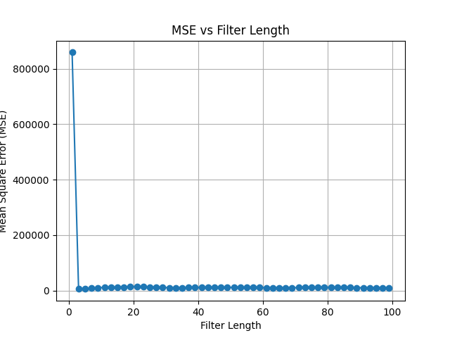
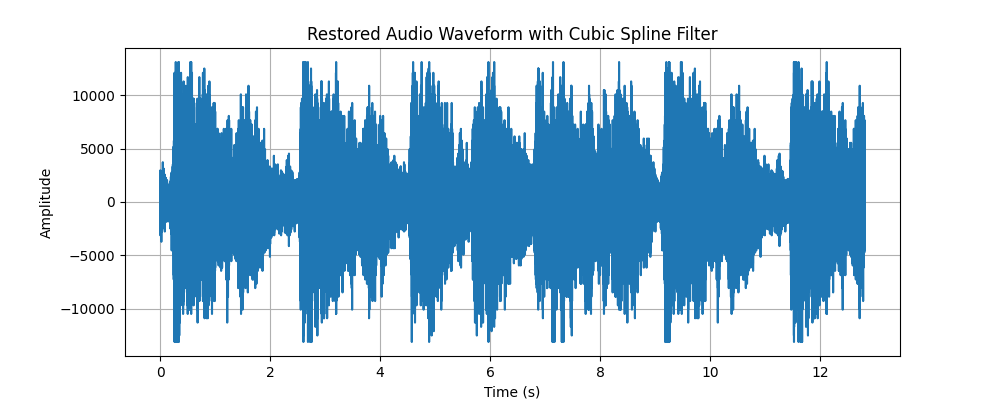

# Median and Cubic Spline audio filters

This assignment includes two audio filters, namely the median filter and the cubic spline filter. Both filters are designed to eliminate clicks in audio files and insert new values using different algorithms.

## High-level Description of the project
This assignment builds on Assignment I. We assume that we have successfully detected the clicks and we are applying different interpolation methods to restore the audio, such as
1. Median Filter: To replace the value at the click with the median value from a set of 'n' values, which includes the click, where 'n' equals the filter_length.
2. Cubic Spline Filter: To fit a smooth curve using a cubic equation for the segments between every two values, thereby inferring the value at the click.

---

## Installation and Execution

Provide details on the Python version and libraries (e.g. numpy version) you are using:

1. numpy: To run unit test for median filter and to build deteciton list for cubic spline 
2. wave: To read and write wav files
3. scipy: To apply cubic spline algorithm
4. playsound: To play restored audio
5. unittest: To test if the median filter code runs well
6. sys: To display a grogress update

One easy way to do it is to do that automatically:
```sh                               
pip install numpy wave scipy playsound unittest sys

pipreqs $project/path/requirements.txt
```
For more details check [here](https://github.com/bndr/pipreqs)


Afer installing all required packages you can run the demo file simply by typing:
```sh
python Median_Assignment2.py
```
Or
```sh
python Spline_Assignment2.py
```
---

# Methodology and Results for Median Filter
Describe here how you have designed your code, e.g. a main script/routine that calls different functions, is the unittesting included in the main routine? 
The main function calls a series of functions wirtten in the script
## 1. Different inputs are defined
```python
file_path = '/Users/tanqiwen/Documents/5C22-python/5C22_Assignment2_filters/'

degraded_file = file_path + 'degraded.wav'
detection_file = file_path + 'detectionfile.wav'
clean_file = file_path + 'clean.wav'
median_output_file = file_path + 'median_output.wav'
```
To run the script, please change file_path to your own file path

## 2. Filter Length is set
```python
filter_length = 3
```
You are free to change the filter_length to any positive odd value

## 3. Degraded audio is recalculated by median filter
```python
restored_audio, rate = median_filter_restore(degraded_file, detection_file, filter_length)
```
The core function of this script is 'median_filter_restored', which reads the degraded audio and detection, recalculates the positions indicated by the detection using a median filter. The principle is to reorder a number of points centered on the click by size and select the median value to replace the number at the click position, where n equals the filter_length. Additionally, during the operation of this function, the progress is indicated by X%, but because the calculation is usually very fast, only 100% is typically visible.

## 4. Restored audio is written in a new wav file
```python
write_wav_file(median_output_file, restored_audio, rate)
```
write_wav_file funciton reads the restored_audio calculated by median filter and write it to an output file which we defined in step 1.

## 5. MSE is calculated
```python
calculate_mse(clean_file, median_output_file)
```
calculate_mse funciton reads the clean audio and restored audio, then subtracts clean from restored, squares the result, and then divides by the length of the audio. Finally, print the mse.

## 6. Unittets
```python
class TestMedianFilterWithNumpy(unittest.TestCase):
    def test_median_filter(self):
        input_list = np.array([1, 2, 3, 4, 5, 6, 7, 8, 9], dtype=np.int16)
        filter_length = 3
        restored_audio, _ = median_filter_restore(input_list, None, filter_length, is_wav=False)

        numpy_result = []
        for i in range(len(input_list)):
            start = max(0, i - filter_length // 2)
            end = min(len(input_list), i + filter_length // 2 + 1)
            window = input_list[start:end]
            numpy_result.append(int(np.median(window)))

        numpy_result = np.array(numpy_result, dtype=np.int16)
        self.assertTrue(np.array_equal(restored_audio, numpy_result))

    def test_filter_length_even(self):
        input_list = np.array([1, 2, 3, 4, 5, 6, 7, 8, 9], dtype=np.int16)
        with self.assertRaises(ValueError):
            median_filter_restore(input_list, None, 4, is_wav=False)
```
Here, the unittest verifies:

1. Whether the computed array is consistent with the array calculated using numpy.median.
2. Whether it can correctly raise an error when the filter length is an even number.

# Methodology and Results for Cubic Spline Filter
The main function calls a series of functions wirtten in the script

## 1. Different inputs are defined
```python
file_path = '/Users/tanqiwen/Documents/5C22-python/5C22_Assignment2_filters/'

degraded_file = file_path + 'degraded.wav'
detection_file = file_path + 'detectionfile.wav'
clean_file = file_path + 'clean.wav'
median_output_file = file_path + 'median_output.wav'
```
To run the script, please change file_path to your own file path

## 2. Degraded audio is recalculated by median filter
```python
restored_audio, rate = cubic_spline_restore(degraded_file, detection_file)
```
The core function of this script is 'cubic_spline_restored', which reads the degraded audio and detection, recalculates the positions indicated by the detection using a cubic spline filter. The principle is to use a cubic equation to fit the curve between every two points, ensuring that the overall curve is differentiable everywhere. It calculates the four parameters of the cubic curve and uses the new points obtained from the curve fitting to replace the original points at the location of the click. Additionally, during the operation of this function, the progress is indicated by X%, but because the calculation is usually very fast, only 100% is typically visible.

## 3. Restored audio is written in a new wav file
```python
write_wav_file(spline_output_file, restored_audio, rate)
```
write_wav_file funciton reads the restored_audio calculated by cubic spline filter and write it to an output file which we defined in step 1.

## 4. MSE is calculated
```python
calculate_mse(clean_file, spline_output_file)
```
calculate_mse funciton reads the clean audio and restored audio, then subtracts clean from restored, squares the result, and then divides by the length of the audio. Finally, print the mse.

# Results

1. For the median filter, different lengths were explored to test the effectiveness of the restoration. In particular, MSE were tested and filter_length=3 was observed to deliver the lowest MSE, as shown in the figure below.



The restored waveform <median_output.wav> with the optimal filter length is given below:


2. Using the cubic splines, we observe ....

The restored waveform <spline_output.wav> is given below:



3. Comparing the two different interpolation methods, we notice that cubic spline filter achieves a lower MSE. The runtime of cubic spline method is 0.001s

After listening to the two restored files, we notice that both filters can complete the noise reduction task well, and although the MSE of the median filter is five times that of the cubic spline filter, the difference is almost inaudible, because all the clicks have been well eliminated.


---
# Credits

This code was developed for purely academic purposes by Qiwen Tan as part of the module 5C22 Computational Methods


